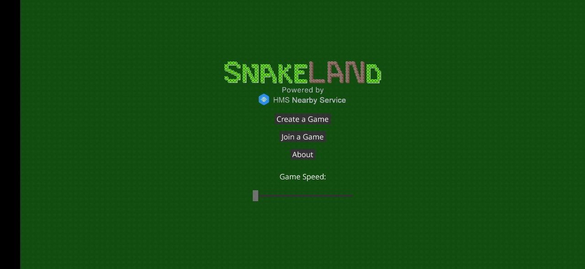
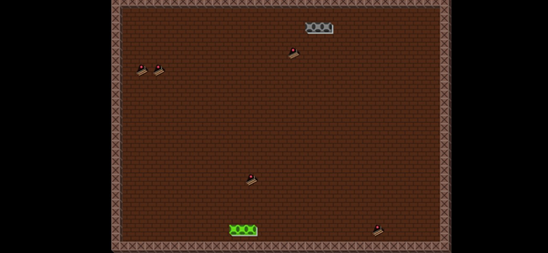

# NearbyGameSnake

## Table of Contents

 * [Introduction](#introduction)
 * [Getting Started](#Getting-Started)
 * [Supported Environments](#supported-environments)
 * [Procedure](#procedure)
 * [Result](#result)
 
## Introduction

The NearbyGameSnake program demonstrates a simple local snake game with HMS Nearby Service. Through HMS Nearby Services, it is easy for two smart phones to establish connection without internet, and play game together.

## Getting Started

1. Build the demo.
(1)To build this demo, please first import the demo in the Android Studio (3.x+). 
(2)Sync and build the project.
2. Prepare two Android phones, and install this app to both phones.

## Supported Environments

Android Studio 3.X or a later version is recommended.

## Procedure

1. open the app on both phones, input your name when first launched. 
2. you can find the other player in the "Nearby Player" List.
3. both sides clicks "Start Game".
4. One pick white side and the other pick black side, then you can play.

## Result
Game Lobby:

In the game:

